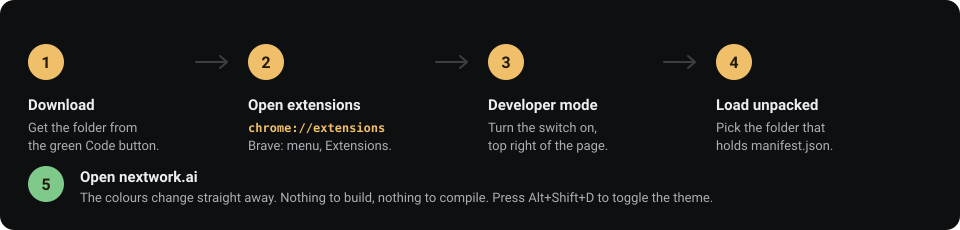

<div align="center">


# Pineapple NextWork Theme Studio Mod

**A browser extension that recolours [nextwork.ai](https://nextwork.ai).**
18 themes, an editor for your own, a picture behind the page, and a focus timer.

[](https://github.com/RoyPiring/nextwork-theme-studio/actions/workflows/ci.yml)
[](LICENSE)

Unofficial. Not made by NextWork and not connected to them.
It sends no data anywhere.

</div>


---

## Install

Works in Chrome, Brave and Edge. Takes about a minute.



**1. Download the folder.** Click the green **Code** button at the top of this
page, choose **Download ZIP**, and unzip it. Or:

```bash
git clone https://github.com/RoyPiring/nextwork-theme-studio
```

**2. Open your browser's extensions page.**

| Browser | Where |
| --- | --- |
| Chrome | `chrome://extensions` |
| Edge | `edge://extensions` |
| Brave | Menu → Extensions → **Manage Extensions** |

> **Brave:** do not type `brave://extensions`. That page has no Developer mode
> switch.

**3. Turn on Developer mode.** The switch is in the top right.

**4. Click Load unpacked** and choose the folder you downloaded. Pick the
folder itself, not a file inside it. It is the one containing `manifest.json`.

**5. Open nextwork.ai.** The colours change straight away.

There is nothing to build and nothing to compile. Press `Alt+Shift+D` to turn
the theme on and off.

**Firefox and Safari** need an extra step →
[installing on other browsers](docs/install/)

---

## Use it

Click the extension icon in your toolbar.

| Control | What it does |
| --- | --- |
| **Theme** | Turns the colours on and off. |
| **Wallpaper** | Turns the picture behind the page on and off. |
| **Focus** | A timer that sits on the page while you work. |
| **Surprise me** | Picks a theme at random. |
| **Dials** | Tint, saturation, contrast and brightness, all at once. |
| **Open editor** | Full control of all nine colours, with a live contrast score. |

The 18 built-in themes cannot be edited. Change a colour and the extension
makes you a copy, leaving the original alone. Your themes are saved on your own
computer. They are never uploaded.

**Focus timer.** Choose 15, 25, 45 or 60 minutes, or count up. A pill appears
in the corner while you work. It only shows on project pages, keeps running
across tabs, and counts past zero so you can see when you go over.

---

## Themes and wallpapers

Every theme has its own picture and its own drifting scenery, and no two are
the same. Nothing is downloaded while you browse.

Text on nextwork.ai sits straight on the page background, so you read it
*through* the picture. Every wallpaper is measured and held to a contrast ratio
of 7:1 where the text sits.

→ [All 18 themes, and how the wallpapers are made](docs/THEMES.md)

---

## Documentation

| Guide | For |
| --- | --- |
| [Install on other browsers](docs/install/) | Firefox and Safari |
| [Themes and wallpapers](docs/THEMES.md) | What ships, and how it is made |
| [Architecture](docs/ARCHITECTURE.md) | How the recolouring works |
| [Decisions](docs/DECISIONS.md) | Choices that are hard to reverse |
| [Browser support](docs/BROWSERS.md) | Differences between browsers |
| [Development](docs/maintenance/DEVELOPMENT.md) | Running tests and tools |
| [Releasing](docs/maintenance/RELEASING.md) | Cutting a version |
| [Regenerating assets](docs/maintenance/ASSETS.md) | Wallpapers, scenery, icon |

→ [Full documentation index](docs/)

---

## Contributing

Contributions are welcome, and adding a theme is the easiest place to start.
There is no build step and no dependency to install.

```bash
npm test              # unit tests
node tools/audit.js   # repository checks, run before every commit
```

→ [How to contribute](CONTRIBUTING.md) ·
[Security](SECURITY.md) ·
[Changelog](CHANGELOG.md) ·
[Code of conduct](CODE_OF_CONDUCT.md)

---

## Licence

MIT. See [LICENSE](LICENSE).

The pictures in `art/` were made for this project and carry the same licence.
Nothing here uses stock photography.
