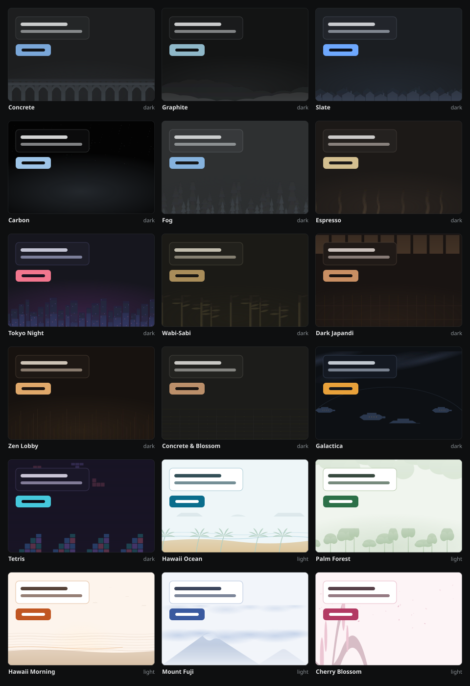

# Pineapple NextWork Theme Studio Mod

[](https://github.com/RoyPiring/nextwork-theme-studio/actions/workflows/ci.yml)

A browser extension that changes the colours of [nextwork.ai](https://nextwork.ai).
It gives you 18 themes, an editor to build your own, and a picture behind the
page.

This is an unofficial project. It is not made by NextWork and is not connected
to them. It never sends any data anywhere.



## Install it

You need Chrome, Brave, or Edge. Firefox and Safari need extra steps, which are
covered further down.

**Step 1.** Download this project. Either click the green **Code** button above
and choose **Download ZIP**, then unzip it, or run:

```bash
git clone https://github.com/RoyPiring/nextwork-theme-studio
```

**Step 2.** Open your browser's extensions page:

| Browser | Page |
| --- | --- |
| Chrome | `chrome://extensions` |
| Edge | `edge://extensions` |
| Brave | Menu, then Extensions, then **Manage Extensions** |

In Brave, do not type `brave://extensions`. That opens a settings page with no
Developer mode switch.

**Step 3.** Turn on **Developer mode**.

**Step 4.** Click **Load unpacked** and choose the folder you downloaded. Pick
the folder itself, not a file inside it. It is the folder that contains
`manifest.json`.

**Step 5.** Open nextwork.ai. The colours should change straight away.

There is nothing to build and nothing to install. The extension runs from the
folder as it is.

To turn the theme on and off, press `Alt+Shift+D`. You can change that shortcut
at `chrome://extensions/shortcuts`.

## Use it

Click the extension icon in your toolbar. You will see three switches:

- **Theme.** Turns the colours on and off.
- **Wallpaper.** Turns the picture behind the page on and off. This is
  separate from the colours.
- **Focus.** A timer that sits on the page while you work.

Below the switches you can pick any of the 18 themes. Four **dials** adjust
every colour at once.

Click **Open editor** for full control. There you can set all nine colours, see
a live contrast score, preview the result, and add your own CSS. An **Extras**
section holds switches for the few things colours alone cannot reach, such as
the logo, code blocks, and panels that stay light. The 18 themes
that come with the extension cannot be edited. If you change a colour, the
extension makes a copy for you to work on and leaves the original alone.

Your themes are saved on your own computer. They are not synced and not
uploaded. To move a theme to another browser, use **Export theme** in the
editor, then **Import** on the other side.

### The focus timer

NextWork projects are long. The theme is there to make one comfortable to read.
The timer is there to help you sit with it, so it only appears on project pages.
You will not see it on the dashboard or on the marketing pages.

Choose 15, 25, 45, or 60 minutes, or choose **Count up** for an open session.
Then press Start.

A small pill appears in the corner of the page, and the toolbar icon shows that
a session is running. The timer keeps going across every tab, and it keeps
going if you close the popup. When time runs out it does not stop. It counts
past zero, so you can see that you went over.

The timer stores start and end times rather than counting seconds. This means
nothing is lost or double counted if your browser restarts.

## Other browsers

Firefox and Safari need a packaged build. Run this to create one:

```bash
node tools/build.js
```

That creates a folder for each browser inside `dist/`, and each folder has its
own install guide. You need Node 18 or newer.

- **Chrome, Brave, and Edge** get the same files. They only have separate
  folders so each one carries the right instructions.
- **Firefox** needs a different settings file, because it runs background code
  in another way. Firefox also removes the extension when you restart, unless
  the extension is signed.
- **Safari** cannot load a folder at all. It has to be turned into a Mac app
  using Xcode, which only works on a Mac.

See [docs/BROWSERS.md](docs/BROWSERS.md) for the details.

## How it works

NextWork is built with Tailwind CSS. Every colour on the site comes from a CSS
variable. For example, `.bg-gray-50` simply means
`background-color: var(--color-gray-50)`.

So this extension does not fight the site. It changes those variables, and the
site recolours itself.

Doing this properly means handling four separate groups of variables. The last
group lives inside shadow roots, which a normal stylesheet cannot reach.
[docs/ARCHITECTURE.md](docs/ARCHITECTURE.md) explains all of it, including the
two problems that took the longest to solve.
[docs/DECISIONS.md](docs/DECISIONS.md) explains the choices that would be hard
to undo.

### The wallpapers

Every theme has its own scene, and no two are the same.

Every theme has its own picture, kept in `art/` and stored inside
`src/wallpapers.js`. Over the top of each one, two layers drift at different
speeds: mist along the floor, and dust in the air. The picture itself does not
move. Without those layers it would look like a desktop background placed
behind the text. Nothing is downloaded while you browse.

There is a hard limit on how bright a wallpaper can be. On nextwork.ai, article
text sits straight on the background with no panel behind it. So you read the
words through the picture. Text needs a contrast ratio of 7:1 to stay
comfortable, and that makes the background very dark.

A picture cannot be checked the same way a single colour can, so
`tools/make-wallpaper.py` measures it instead. It pushes the middle of the
image, where your text sits, further than the sides, where the picture is. Dark
themes get darker and light themes get lighter, because the two need opposite
treatment.

Every wallpaper ships at 7:1 or better in the reading area, and 4.5:1 or better
at the edges. Both numbers are recorded for each picture and the tests check
them.

## What is in this project

```
manifest.json          Settings the browser reads
src/theme-engine.js    Colours, contrast maths, and CSS generation
src/scenes.js          The mist and dust that drift over each wallpaper
src/wallpapers.js      Picture wallpapers, stored inside the file
src/content.js         Adds the stylesheet to the page
src/background.js      Keyboard shortcut and toolbar icon
src/popup.*            The panel behind the toolbar icon
src/options.*          The editor
art/                   Source pictures. Build input only, nothing here ships
assets/                Those drifting layers saved as SVG files you can open
tools/                 Tests, packaging, and image tools
tests/                 Unit tests, run with npm test
docs/                  Longer guides, and the work queue in PLAN.md
```

## Working on it

There is no build step and no libraries to install. Edit a file, click Reload on
the extension card, then refresh the page. Node 18 or newer is needed only for
the tools below.

```bash
npm test                      # unit tests
node tools/audit.js           # repository checks, run before every commit
node tools/build.js           # build a folder for each browser
node tools/export-scenes.js   # save the drifting layers as SVG files
node tools/gallery.js         # rebuild the picture at the top of this README
node tools/contact-sheet.js   # view all 18 scenes on one page
node tools/split-repro.js     # reproduce the split-view bleed-through
python tools/make-wallpaper.py --all art   # rebuild every wallpaper
```

`tools/audit.js` is the important one. It checks the settings file, reads every
script, confirms the extension makes no network requests, confirms it uses no
unsafe code, and checks the contrast of all 18 themes. Every test in it exists
because that exact problem happened at some point.

[CONTRIBUTING.md](CONTRIBUTING.md) tells you how to add a theme.
[SECURITY.md](SECURITY.md) explains what the extension can and cannot do.
[CHANGELOG.md](CHANGELOG.md) lists what changed.
[CODE_OF_CONDUCT.md](CODE_OF_CONDUCT.md) covers behaviour.

## Licence

MIT. See [LICENSE](LICENSE).

The pictures in `art/` were made for this project and are covered by the same
licence. Nothing in this repository uses stock photography.
